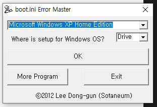

# Boot Error Master For Windows XP

## Support OS

- Microsoft Windows XP Home Edition
- Microsoft Windows XP Professional

## Download

- [Windows x64 zip file ](./build/Windows&#32;x64.zip)

## Info

- 윈도우 XP에서 발생하는 BOOT.INI 파일 오류를 해결하기 위한 프로그램입니다.
- 해당 문제에 대한 정보는 [여기](https://blog.naver.com/cyydo96/221119561219)를 참고하세요.

## What did you learn?

- Visual Basic 6.0 사용 방법을 배웠습니다.
- I/O를 배웠습니다.

## Finally

- 더는 업데이트를 지원하지 않는 XP 운영체제와 관련된 프로젝트입니다. 이 프로젝트도 마찬가지로 추가적인 문제가 없는 한 업데이트가 없습니다.
- 블로그에서 자주 해결하지 못하는 이슈가 발생했던 것을 간단하게 해결시켜줄 프로그램을 구현했습니다.

## Modify Content

- 2012.11.04 ( 0.0.1 )
  - 프로젝트 초기 버전 구현
  - Microsoft Windows XP Home Edition 지원
  - Microsoft Windows XP Professional 지원

## Copyright    

- 비상업적 용도로 사용 가능하며 링크를 반드시 포함해주세요.
- 문제가 되는 내용이 있다면 언제든지 [`issue`](https://github.com/Sotaneum/Boot-Error-Master-For-Windows-XP/issues/new), [`Pull requests`](https://github.com/Sotaneum/Boot-Error-Master-For-Windows-XP/compare) 부탁드립니다.